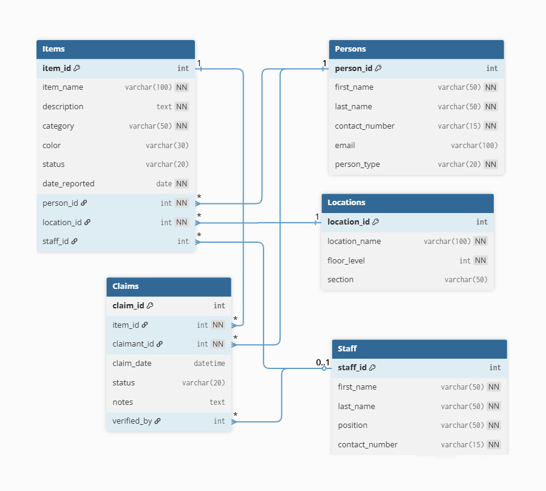
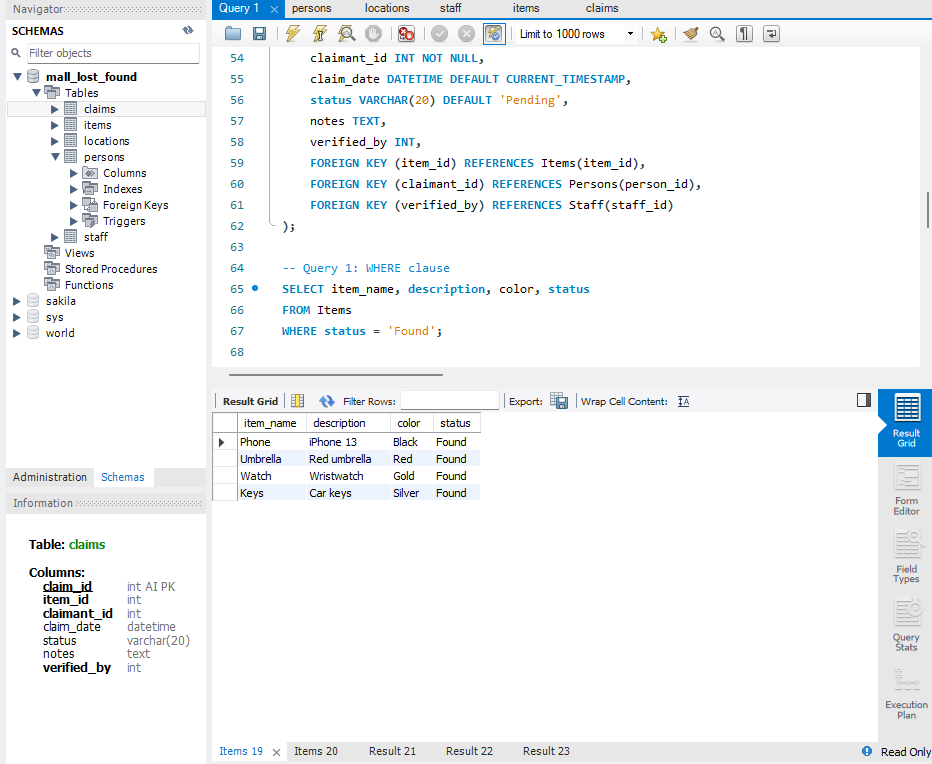
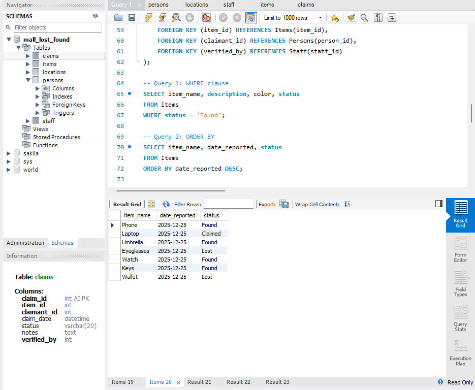
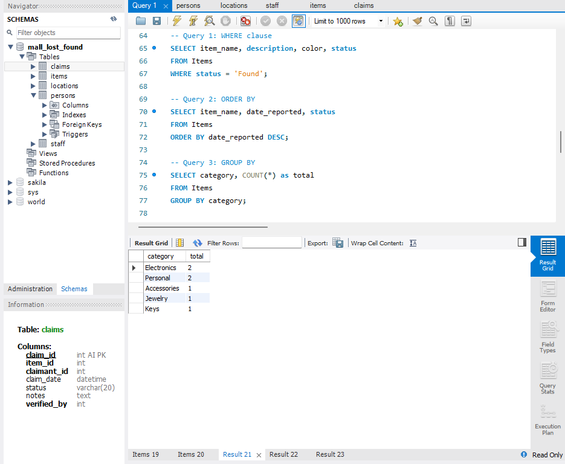
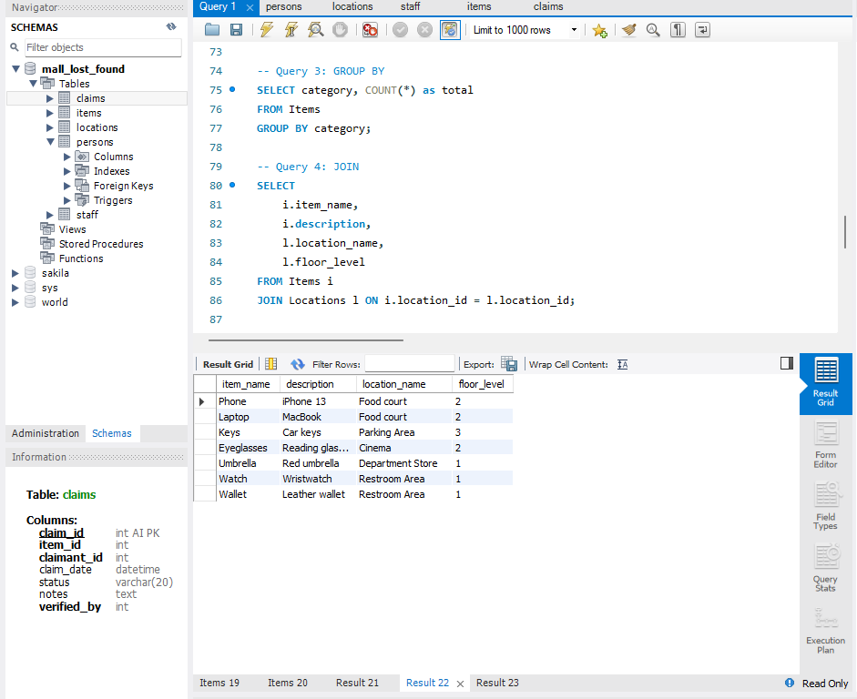
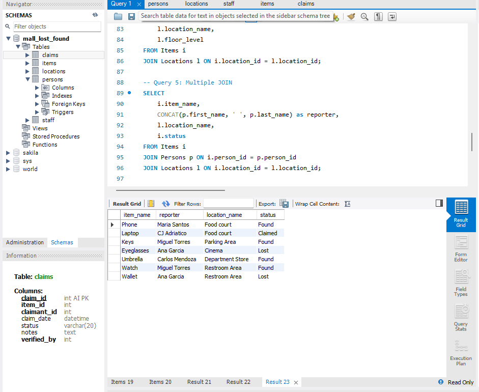

# Mall Lost and Found Database System

### CC 105 - Information Management Final Project

Adriatico, Ceihiro Jazel  
January 2026

---

---

## Overview

A database system to manage lost and found items in a shopping mall. The system tracks items, people (reporters/finders/claimants), locations, staff, and claims processing.

### Purpose
- Track lost and found items efficiently
- Record who reported, found, or claimed items
- Manage verification and approval of claims
- Assign staff to handle items
- Monitor item status (Lost, Found, Claimed, Returned)

---

## Entity Relationship Diagram

---

## Structure

The database consists of **5 tables** normalized to **3NF**:

### 1. Persons
Stores people who interact with the system (reporters, finders, claimants)
- 6 sample records
- Tracks contact information and person type

### 2. Locations  
Mall locations where items are lost/found
- 5 locations (Food Court, Parking Area, Cinema, Department Store, Restroom Area)
- Records floor level and section

### 3. Staff
Mall employees managing the Lost and Found office
- 5 staff members (Manager, Security, Staff)
- Unique contact numbers

### 4. Items
Lost and found items with detailed information
- 7 sample items (Phone, Laptop, Umbrella, Eyeglasses, Watch, Keys, Wallet)
- Status: Lost, Found, Claimed, Returned
- Links to person, location, and staff

### 5. Claims
Claim requests for items
- 5 sample claims
- Status: Pending, Approved, Rejected
- Tracks verification notes

---

## Relationships

1. **Persons   - Items**  (1:Many)  - One person can report/find many items
2. **Locations - Items**  (1:Many)  - One location has many items
3. **Staff     - Items**  (1:Many)  - One staff handles many items
4. **Items     - Claims** (1:Many)  - One item can have many claims
5. **Persons   - Claims** (1:Many)  - One person can file many claims
6. **Staff     - Claims** (1:Many)  - One staff verifies many claims

---

## 🔍 Sample Queries & Results

### Query 1 - Find Found Items (WHERE)
Find all items with "Found" status

### Query 2 - Sort by Date (ORDER BY)
Show items sorted by newest first

### Query 3 - Count by Category (GROUP BY)
Count how many items in each category

### Query 4 - Items with Locations (JOIN)
Show items with their location details

### Query 5 - Items with Reporter Info (Multiple JOIN)
Complete item info with person and location

---

## Operations

**SELECT** queries with WHERE, ORDER BY, GROUP BY  
**JOIN**   queries (single and multiple)  
**UPDATE** operations (item status, claim status)  
**DELETE** operations (rejected claims, old items)

---

## Installation

1. Open MySQL Workbench
2. File - Open SQL Script
3. Select `mall_lost_found.sql`
4. Click Execute 
5. Database created with sample data

---

## 🔧 Technical Details

- **Database:** MySQL
- **Tables:** 5
- **Total Records:** 28
- **Normalization:** 3NF

- **Constraints:** Primary Keys, Foreign Keys, NOT NULL, UNIQUE, DEFAULT

